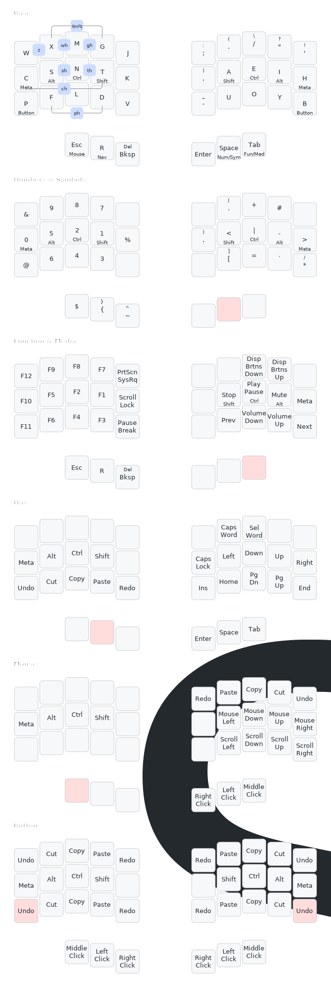
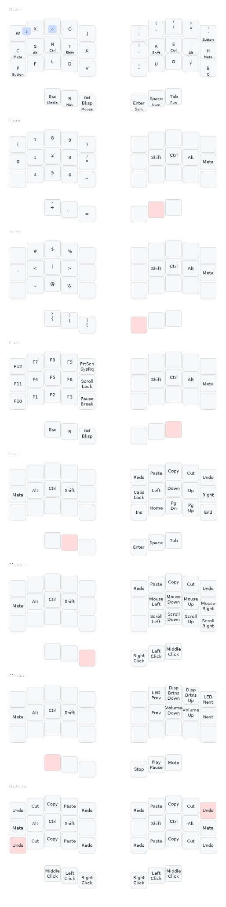

# Keyboard Layouts

## Usage

### Vial

```bash
nix develop
vial-qmk compile -kb svalboard/trackpoint/right -km vial
vial-qmk flash -kb svalboard/trackpoint/right -km vial
```

You can then use `Vial` to configure the keyboard.

### Atreus (QMK)

```bash
nix develop
qmk flash -kb keyboardio/atreus -km SiriusStarr
```

For keylogging, set `CONSOLE_ENABLE = yes` in `rules.mk` and uncomment
`#define CONSOLE_KEY_LOGGER_ENABLE` in `config.h`.  On the host computer, run
`./listen_keylogger.sh` to log output to `keylog.csv`.  This data can be
analyzed [here](https://precondition.github.io/qmk-heatmap).

### Kaleidoscope

```bash
nix develop
cd <keyboard>
make compile
eeprom-backup.sh
make flash
eeprom-restore.sh
```

## Layout

### Updating

```bash
keymap draw QMK/Layout.yaml > QMK/Layout.svg
keymap draw Kaleidoscope/Layout.yaml > Kaleidoscope/Layout.svg
```

### SVG (QMK)



### SVG (Kaleidoscope)


