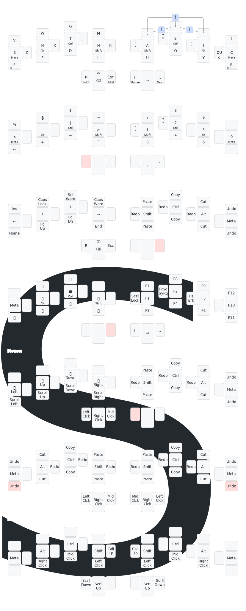

# Keyboard Layouts

## Usage

### Svalboard (QMK)

```bash
nix develop
# Plug in left side
qmk flash -kb svalboard/trackpoint/left -km SiriusStarr
# Plug in right side
qmk flash -kb svalboard/trackball/pmw3389/right -km SiriusStarr
```

For keylogging, set `CONSOLE_ENABLE = yes` in `rules.mk` and uncomment
`#define CONSOLE_KEY_LOGGER_ENABLE` in `config.h`. On the host computer, run
`./listen_keylogger.sh` to log output to `keylog.csv`. This data can be analyzed
[here](https://precondition.github.io/qmk-heatmap).

### Atreus (QMK)

```bash
nix develop
qmk flash -kb keyboardio/atreus -km SiriusStarr
```

For keylogging, set `CONSOLE_ENABLE = yes` in `rules.mk` and uncomment
`#define CONSOLE_KEY_LOGGER_ENABLE` in `config.h`. On the host computer, run
`./listen_keylogger.sh` to log output to `keylog.csv`. This data can be analyzed
[here](https://precondition.github.io/qmk-heatmap).

### Kaleidoscope

```bash
nix develop
cd <keyboard>
make compile
eeprom-backup.sh
make flash
eeprom-restore.sh
```

## Layout

### SVG (Atreus)


### SVG (Svaboard)



### SVG (Model 100)


